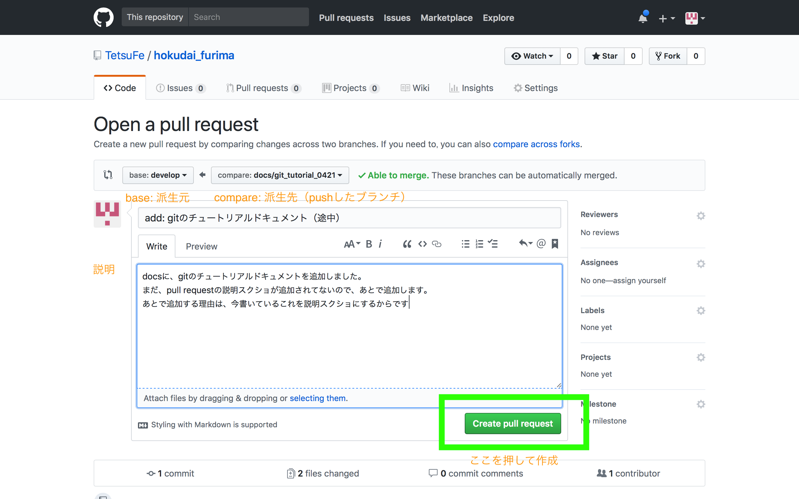

# gitとgithubを知る・使う

## 必ず守ってほしいこと
gitのコマンドを実行すると、英語のメッセージが出る。できれば最初のうちは全部に目を通して英語を理解して、問題が起こっていそうならそのメッセージをコピペしてgoogle検索 or 誰かに質問するようにしてほしい。

## 目次
- [1. gitとは](#chap1)
    - なぜgitを使うのか・メリット
    - githubとは 
    - gitの基本コマンドを知る
- [2. gitを使ってみる](#chap2)
    - gitの初期設定
    - gitの流れを体験する

## <a id="chap1">gitとは</a>
gitとは、ある「レポジトリ（＝ディレクトリ）」のファイルの差分を記録するコマンドである

## なぜgitを使うのか・メリット
- 変更を元に戻せる
- 複数人で同じところを変更（＝コンフリクト）した時に検知してくれる
- 「ブランチ」に分けて、並行して細かい部分毎にファイルの差分を記録できる
    - 例：サイトの見た目と中身の処理を並行してその日の気分で進めたい
        - ブランチがない場合：「サイトの見た目」だけやっぱり前に戻したい！でも問題ない「中身の処理も戻さないといけない
        - ブランチがある場合：「サイトの見た目」のブランチだけまずマージ（ソースコードの結合）して、「中身の処理」のブランチはコンフリクトを解消してからマージ

（実際には、ブランチを分けていなくても、コミットを別々にしていればコミット毎に元に戻すことができる。けどもそれは面倒。やっていけばわかる）

## githubとは
githubは以下のような特徴を持ったサイト
- gitの差分記録を見やすく表示
- オンライン上に差分記録を保存しておけるストレージ
- issueやpull requestといった機能で、複数人で課題管理をしたり、チャットしたりして円滑に複数人開発ができる


## gitの基本コマンドを知る

### レポジトリの新規作成
`$ git init`

### コミットに含むファイルの決定（ステージング・track）
`$ git add ファイル名 # git add -A ならカレントディレクトリ以下のすべてのファイル`

### コミット（ファイル差分の記録）
`$ git commit -m "コミットメッセージ"`

### プッシュ（リモートへのアップロード）
`$ git push # git push origin masterの略。ブランチを指定する場合は、$ git push origin ブランチ名`

### プル（リモートからローカルへのダウンロード）
`$ git pull`


## ブランチ
gitには「ブランチ」という、コミットを分けておける機能がある。

例えば、今ある「ブランチA」を「ブランチB」と「ブランチC」に分けて作業する。

- 「ブランチB」ではindex.htmlを編集
- 「ブランチC」ではstyle.cssを編集

というようにすると、「ブランチB」でindex.htmlを編集しても、「ブランチC」ではindex.htmlは変更されない。

これは何がいいかと言うと、例えば、そのまま「ブランチA」でindex.htmlとstyle.cssを編集したとすると、間違って

`$ git add -A`

`$ git commit -m "update: サイトの見た目"`

などしてしまったとき、index.htmlとstyle.cssの両方が同じコミットに含まれてしまう。
こうなると、このときにindex.htmlの方だけ失敗して元に戻したい場合、style.cssも元に戻ってしまう。

- 「ブランチB」ではindex.htmlを編集
- 「ブランチC」ではstyle.cssを編集

というようにブランチを分けておくことで、このような事態を防げるし、コミットに神経質にならずに済む

また、後述の「pull request」を送るときに意図が理解しやすかったりもする

### 新しいブランチを作る
`$ git checkout -b ブランチ名`

### ブランチ間の移動
`$ git checkout ブランチ名`

覚えておくことは、
- 「ブランチA」で行ったコミットは、他のブランチには影響を与えない
ということ

## ブランチをマージ（ソースコードの統合）する
新しく作ったブランチBを派生元のブランチAにマージすることで、ソースコードの更新が完了する。

### マージ
`$ git merge 今のブランチにマージしたい他のブランチ名`


## <a id="chap2"> 2. gitを使ってみる</a>
ここから、実際にコマンドを実行していこう。

## gitの初期設定

- gitのインストール（済んでいるとする。コマンドライン（ターミナル・コマンドプロンプト）で`git`と打ってエラーが出なかったらインストールされている）
- gitの署名（コミットするときの名義。誰が編集したかわかるようにする）
- ショートカット
- 諸設定

### gitの署名
以下の２行は、自分の設定によって変わるので、単純にコピペしないように

`$ git config --global user.name "ユーザ名" # (githubのユーザ名。""で囲む)`

`$ git config --global user.email githubのメアド # ""で囲まない`

### 諸設定
`$ git config --global push.default matching  # git push としたとき、ローカルとリモートで同じ名前のブランチがあったら、全て push する。`

### ショートカット
`$ git config --global alias.co checkout #任意。checkoutをcoと短縮系で使えるようになる  `


## 2. gitの流れを体験する
- レポジトリ作成もしくはクローン
- ブランチ作成
- ファイルの編集
- コミット
- push
- pull request
- マージ

という流れになる。


### 2-1. レポジトリ作成もしくはクローン
「北大フリマ」の場合は、すでにレポジトリはリモートに作成されているので、

`$ #git init`

はしなくてよい。（コピペ防止のため、コメントアウトしてある）

代わりに、「クローン」する

`$ git clone https://github.com/TetsuFe/hokudai_furima.git # git clone リポジトリURL`

クローンしたら、カレントディレクトリに、`hokudai_furima`というディレクトリができるので、

`$ cd hokudai_furima`

などして移動する。

### 2-2. リモートからローカルにブランチをダウンロード
「北大フリマ」の場合は、
リモートに

- master
- develop

の二つ（かそれ以上）のブランチがあるが、クローンしたばかりの今の時点では、masterしか表示されない。

`$ git branch # 全てのローカルにあるブランチを表示`

```
* master
```

そこで、リモートにある`develop`もローカルにもってくるために以下のコマンドを実行

`$ git checkout -b develop origin/develop`

すると、

`$ git branch # 全てのローカルにあるブランチを表示`

```
* develop
master
```

(`*`が今いるブランチ)

developブランチの取得と、developブランチへの移動が完了したことが確認できた。

### 補足：他のリモートにあるブランチを持ってきたいとき

`$ git branch -r`

とすると、リモートのブランチの一覧が出てくる。

```
  origin/HEAD -> origin/master
  origin/develop
  origin/master
```

ここからクローンしたいブランチを選んで、

`$ git checkout -b ブランチ名 origin/ブランチ名`

のようにすれば、追加で他のブランチもクローンできる。

（**補足終わり**）

### 2-3. ブランチ間の移動・派生先ブランチの作成
`$ git checkout -b ブランチ名(追加する機能などの名前) # $ ブランチ名の例：remove/unused_email_templates ）`

ブランチは、まず`$git init`した時点で、デフォルトの「master」ブランチが作成され、

- master
    - develop（masterブランチから派生）
        - ブランチA（developブランチから派生）
        - ブランチB（developブランチから派生）

という形で作成していく。

「北大フリマ」の場合では、今までの操作で

- master
    - develop
        - さっき追加したブランチ

という関係が作られているはず。

`$ git branch`  

```
  develop
* さっき追加したブランチ
  master
```

となっていればOK。

### 2-4. ファイルの編集
普通にコーディングする。（ブランチ名に沿った内容にとどめておくことが望ましい）

編集したファイルの確認

`$ git status # メッセージの意味がわからなかったらググる！`

### 2-5. addとコミット
`$ git add ファイル名 # もしくは、git add -A など`

`$ git commit -m "コミットメッセージ" # e.g: git commit -m "add: oo機能を追加"`

コミットできているかの確認

`$ git status # メッセージの意味がわからなかったらググる！`

### 2-6. プッシュ
pushは、ローカル（自分のPC）のコミットやブランチをリモートのレポジトリに反映する操作です。

初回のみ、ローカルとリモートのレポジトリを紐づける以下の一行を実行します


`$ git remote add origin レポジトリURL # ブラウザのURLバーのURLとは別なので注意！`

`$ git push origin 現在のブランチ名`

ここで注意すべき点は、次の「pull requst」を見越してブランチをpushする必要があるということです。

「pull request」では、

- 「派生元ブランチA（派生する前のブランチ）」
- 「派生先ブランチB（＝pushするブランチ）」

のセットで行います。

なので、派生元のブランチAがあることを確認して、

`$ git push origin 派生先のブランチB`

としましょう。

逆によくない例としては、「派生元ブランチA」がリモートにない場合（２回以上checkoutしてブランチを２階層以上先まで派生させたとき）、「pull request」が正常にできないことがある

### 2-7. pull request（次の「マージ」が先に来る場合もある）
github上で、pull requestを送る。
派生元のブランチと、pushした変更後のブランチで違いを見て、問題がないかサイト上で確認ができる。

- base: 派生元ブランチA
- compare: pushしたブランチ（派生先ブランチB）

という形でpull requestを送る




### 2-8. マージ
`$ git merge 今のブランチにマージしたい他のブランチ名`

もしくは、

githubのpull request上でマージ
